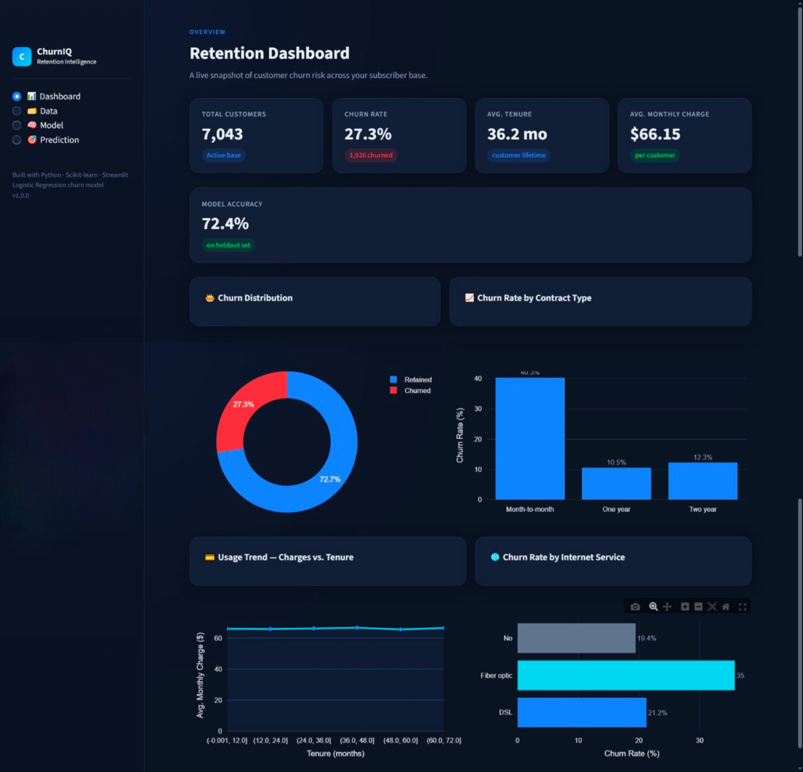
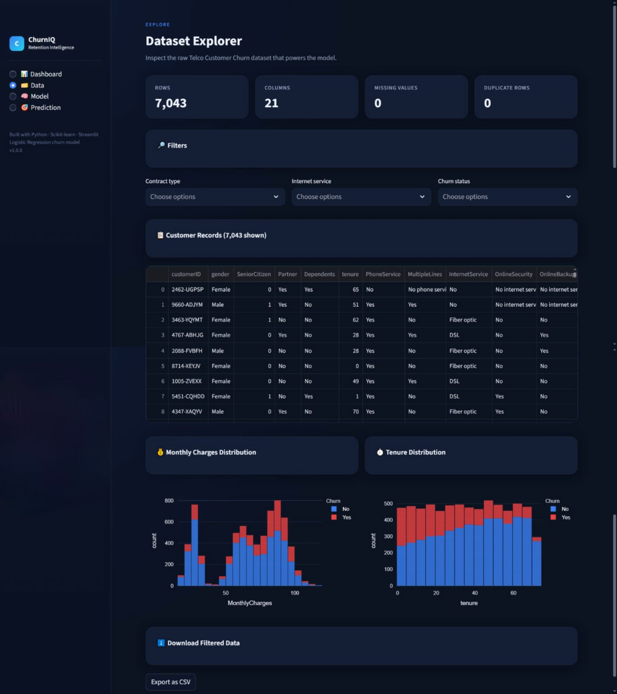
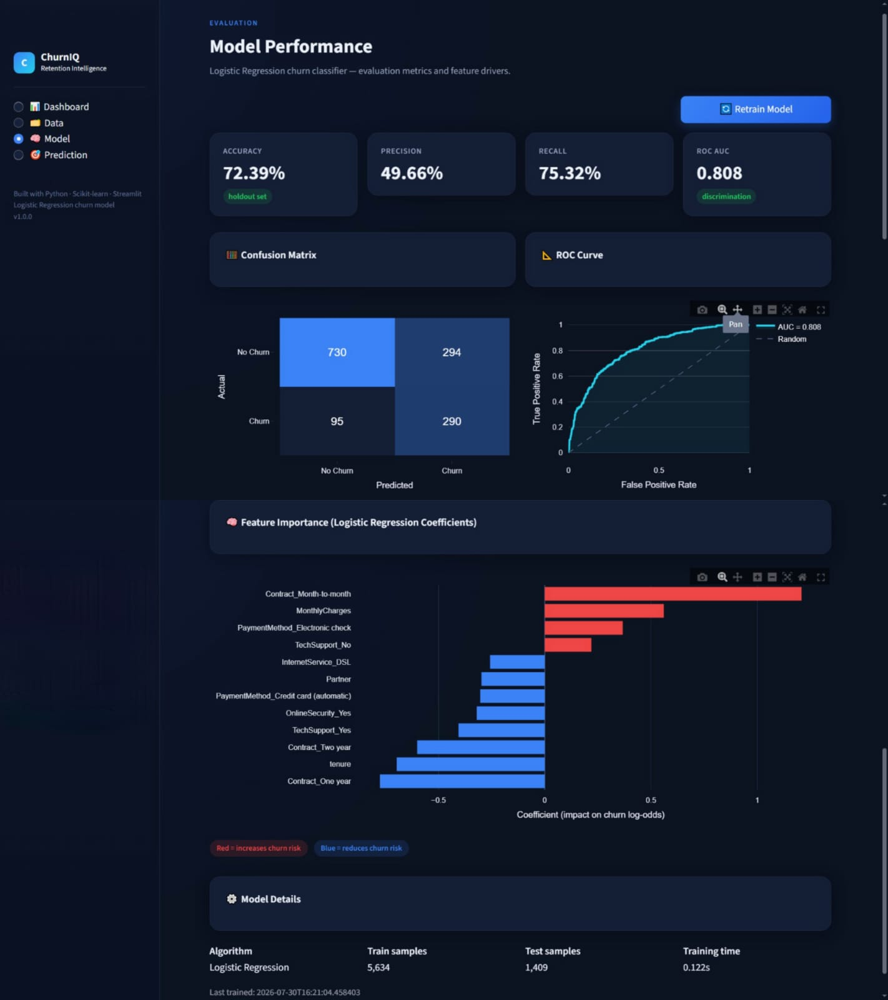
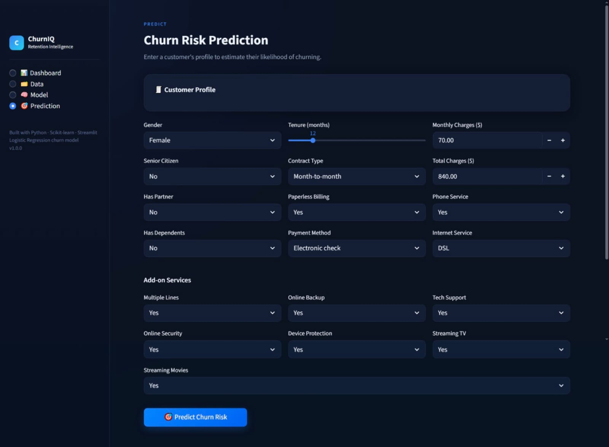

# 🚀 ChurnIQ — Customer Churn Prediction System

ChurnIQ is a production-ready machine learning web application that predicts customer churn using behavioral and subscription data. It provides an interactive dashboard, model insights, and real-time prediction capabilities.

---

## 📸 Screenshots

### 📊 Dashboard


### 🗂️ Data Explorer


### 🧠 Model Insights


### 🎯 Prediction


---

## 🚀 Features

- 📈 Interactive Dashboard with key business metrics  
- 🗂️ Data Explorer for dataset analysis  
- 🧠 Model Insights with evaluation metrics  
- 🎯 Real-time Customer Churn Prediction  
- 📊 Visualizations for churn trends and patterns  

---

## 🧠 Machine Learning

- Model: Logistic Regression  
- Preprocessing:
  - Missing value handling  
  - Encoding categorical variables  
  - Feature scaling  
- Evaluation:
  - Accuracy Score  
  - Confusion Matrix  

---

## 🛠️ Tech Stack

- Python  
- Streamlit  
- Scikit-learn  
- Pandas, NumPy  
- Matplotlib, Seaborn  

---

## 📁 Project Structure

churn-app/
│── app.py
│── requirements.txt
│── README.md
│
├── assets/
├── data/
├── models/
├── pages_src/
├── src/


---

## ▶️ How to Run

```bash
pip install -r requirements.txt
streamlit run app.py

---

💡 Future Improvements
Deploy on Streamlit Cloud / Render
Add advanced models (XGBoost, Random Forest)
Add user authentication
Improve UI/UX animations

👨‍💻 Author

Developed by Meghashri Lakshmi S